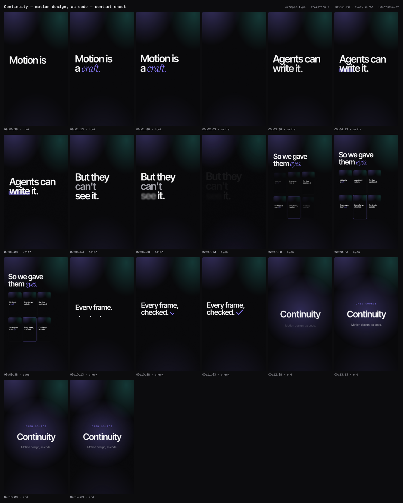

# Continuity

**An open-source harness that lets AI agents make state-of-the-art motion design — as code — and check their own work.**

Agents already write good code. What they make as *motion* is usually not good:
linear easing, everything moving at once, nothing settling, text colliding
mid-move, dead holds, frames nobody composed. And they can't see any of it.

Continuity gives coding agents (Claude Code first) three things:

1. **A motion vocabulary with taste built in** — tokens (durations, eases,
   springs, staggers, read time), presets, transitions and a video-scale UI kit.
   Every animation is declared as **data**, so it can be rendered, linted and
   critiqued from the same source.
2. **Eyes** — stills, timecoded contact sheets, onion-skin motion strips, a
   motion-energy chart of the render, and a gate that audits layout, contrast,
   safe areas, type size, clipping, collisions-in-motion, easing, settle, read
   time and dead air — every finding keyed to an element id and a time.
3. **A studio process** — a director plans the storyboard, scene-builders work
   in parallel, a critic scores each cut on five axes, and only measured
   improvements are kept.

Everything in the render path is OSI-licensed (Apache-2.0 engine, OFL fonts).
No GSAP, no network at render time, byte-identical frames across worker counts.

| | |
|---|---|
|  | **example-launch** — 31.4s 16:9 launch film for Continuity itself, made by the agent team (director → 7 parallel scene-builders → critic, two improvement rounds). Gate 0/0, critique 3.8 → 4.4 → **4.6**/5. |
|  | **example-type** — 14.7s 9:16 kinetic type, made through the harness. Gate: 0 errors. Critique mean 4.2/5. |

## Install

In the repo where you want to make videos (Node ≥ 22, ffmpeg, a headless Chrome):

```bash
npm i -D @litterthanlit/continuity     # the ct CLI + engine (pnpm/yarn/bun work too)
npx ct init                            # config, projects/, .gitignore + CLAUDE.md blocks, permissions
```

Then, in Claude Code, add the agent layer (skills, director / scene-builder / critic
agents, commands and gate hooks):

```
/plugin marketplace add litterthanlit/continuity
/plugin install continuity@continuity
/continuity:make-video A 20s launch video for …
```

`/continuity:setup` does the npm + `ct init` steps for you. `npx ct doctor` tells
you what's missing (no headless Chrome → `npx playwright install chromium-headless-shell`
or set `CT_BROWSER_PATH`).

## How it works

```
 brief.md ─▶ director ─▶ storyboard.json ─▶ scene-builders (parallel) ─▶ scenes/*.tsx
                                                                       │
                     ┌──────────── ct build ◀──────────────────────────┘
                     ▼
     HyperFrames composition (HTML + Tailwind + vendored fonts + motion runtime)
                     │
   ┌─────── gate ────┼──────────── eyes ─────────────┐
   │ ct lint  (timeline motion lint, schema, glyphs) │ ct stills / sheet / strip
   │ ct check (HyperFrames layout + contrast,        │ ct render → ct motion
   │           Continuity probe: safe areas, type,   │
   │           clipping, collisions in motion)       │
   └─────────────────┬───────────────────────────────┘
                     ▼
        critic: 5-axis score + fixes ─▶ iterate (≤3) ─▶ compare / verdict ─▶ best
```

- **Scenes = view + motion.** A scene file exports a static view (Preact JSX →
  HTML at build time, styled with Tailwind using theme tokens) and a `motion(m)`
  function that declares tweens with presets and tokens.
- **Motion is a pure function of time.** A small runtime registers one
  HyperFrames *frame source* per scene and evaluates the timeline per frame —
  deterministic under seek-based capture.
- **Engine:** [HyperFrames](https://github.com/heygen-com/hyperframes)
  (Apache-2.0), pinned exactly. Why, and what we learned:
  [`docs/decisions/0001-engine-hyperframes.md`](docs/decisions/0001-engine-hyperframes.md).

## By hand

```bash
npx ct new my-video --aspect 9:16 --theme mono-dark
# write projects/my-video/brief.md + storyboard.json + scenes/*.tsx — or let an agent:
#   claude  →  /continuity:make-video "A 15s reel announcing …"
npx ct check my-video   # the gate
npx ct sheet my-video   # look
npx ct render my-video  # MP4 + QC
```

Layout lives in `continuity.json` (`projectsDir`, `buildDir`, `outDir`; defaults
`projects`, `build`, `out`). `ct` finds it from any subdirectory.

A scene:

```tsx
import { scene, Stage, Safe, Center, Headline, Serif, Emph } from "continuity";

export default scene({
  view: ({ text }) => (
    <Stage bg="aurora">
      <Safe><Center>
        <Headline ct="title" size="display">
          <Emph text={text.title} word="craft.">{(w) => <Serif class="text-accent">{w}</Serif>}</Emph>
        </Headline>
      </Center></Safe>
    </Stage>
  ),
  motion: (m) => {
    m.enter("title", "maskUp", { at: "b1", split: "lines" });
    m.camera({ scale: [1, 1.04] });
  },
});
```

## The agent layer (Claude Code plugin)

The plugin (`plugin/`, namespaced `continuity:`) holds:

- **Skills:** `continuity` (the loop + API), `motion-craft` (timing, easing,
  choreography, composition — with numbers), `kinetic-type`, `product-launch`,
  `critique` (5-axis rubric), `hyperframes-ref`.
- **Agents:** `director`, `scene-builder`, `critic`.
- **Commands:** `/continuity:make-video`, `/continuity:iterate`, `/continuity:review`,
  `/continuity:render`, `/continuity:setup`.
- **Hooks:** every project edit runs `ct lint` and feeds errors back; the agent
  can't declare "done" while a changed project hasn't passed `ct check`; session
  start reports the toolchain (and installs dependencies in cloud sessions).
  Silent in repos that don't use Continuity.

`ct init` adds the hard rules to your `CLAUDE.md` (a managed block) and allows
`Bash(npx ct:*)` — plugins can't grant permissions themselves.

## Any MCP client (Cursor, Codex, VS Code, Claude Desktop, …)

`ct mcp` is a stdio MCP server with the whole studio as tools. Contact sheets,
stills, motion strips and compare packs come back **as images**; gate findings come
back as **structured data**. The guides (motion craft, critique rubric, API) are
resources, and `make-video` / `review` are prompts.

```json
{
  "mcpServers": {
    "continuity": {
      "command": "npx",
      "args": ["-y", "--package=@litterthanlit/continuity", "ct", "mcp"],
      "env": { "CT_ROOT": "/absolute/path/to/your/repo" }
    }
  }
}
```

`npx ct mcp --config` prints this for Claude Desktop, Cursor, VS Code, Codex and Claude Code.

| Group | Tools |
|---|---|
| Setup | `doctor` · `init_repo` · `list_projects` · `new_project` |
| Project files (sandboxed to a project's sources; writes return lint findings) | `list_project_files` · `read_project_file` · `write_project_file` |
| Gate | `lint` · `check` · `timeline` |
| Eyes (images) | `stills` · `contact_sheet` · `motion_strip` · `motion_analysis` |
| Ship | `render` · `report` |
| Bookkeeping | `status` · `score` · `compare` · `verdict` · `restore` |
| Reference | `catalog` |

Every operation runs in a fresh `ct` child process, so scene edits are always
picked up and nothing but the protocol touches stdout. Long checks and renders
send progress notifications; if your client caps tool calls (often 60s), raise the
timeout or use `check` with `scene` and `render` with `draft` while iterating.
Claude Code users don't need this: the plugin drives `npx ct` directly.

## CLI

`npx ct <command>` — `init · new · build · lint · check · timeline · stills · sheet ·
strip · render · motion · status · score · compare · verdict · restore · report ·
docs · licenses · gate-status · doctor · mcp`. `npx ct <command> --help` for options.

## Design system

Three themes (`mono-dark`, `light-editorial`, `vivid-gradient`), a 1080-based
type scale (`text-mega` 240 → `text-micro` 26), vendored Geist / Inter Tight /
Instrument Serif / Geist Mono + symbol fallbacks, a UI kit at video scale
(windows, browsers, phones, code, terminals, charts, cursor, toasts…). See
`projects/_kit` for the gallery and `plugin/skills/continuity/reference/` for
the generated catalog.

## Developing Continuity

This repo is both the product and its own first user: `pnpm install` links the
package to itself, so `npx ct` here runs the same launcher users get, and
`.claude/` symlinks the plugin's skills/agents/commands for in-repo sessions.
`CLAUDE.md` is the constitution.

```bash
pnpm install                        # Node ≥ 22, ffmpeg on PATH; uses a local headless Chrome
pnpm verify                         # typecheck + eslint + unit tests
CT_SLOW=1 pnpm test                 # + browser tests: every seeded defect is caught, golden frames match
npx ct licenses                     # OSI-only production dependencies
node scripts/pack-smoke.mjs --browser [--pm pnpm]   # the packed tarball, driven in a fresh repo
claude plugin validate ./plugin --strict
pnpm bench run                      # headless /make-video over bench/briefs (slow; costs tokens)
```

**Releasing:** bump `version` in `package.json` and `plugin/.claude-plugin/plugin.json`,
then push a tag `vX.Y.Z` — or run the Release workflow on `main` (it tags v<version> itself). `.github/workflows/release.yml` verifies, publishes to npm
with provenance via trusted publishing (no token) and cuts a GitHub release. Why it's
packaged this way: [`docs/decisions/0002-distribution.md`](docs/decisions/0002-distribution.md).

## Roadmap

- Voiceover with word timings + beat-synced music (storyboard `audio` track).
- Docker image pinning Chrome/fonts/ffmpeg for pixel-exact CI; cloud rendering.
- Multi-aspect variants from one storyboard (16:9 ↔ 9:16 ↔ 1:1).
- A web studio over the same CLI; a pairwise judge calibrated on the bench.

## License

Apache-2.0 — see `LICENSE` and `NOTICE`.
