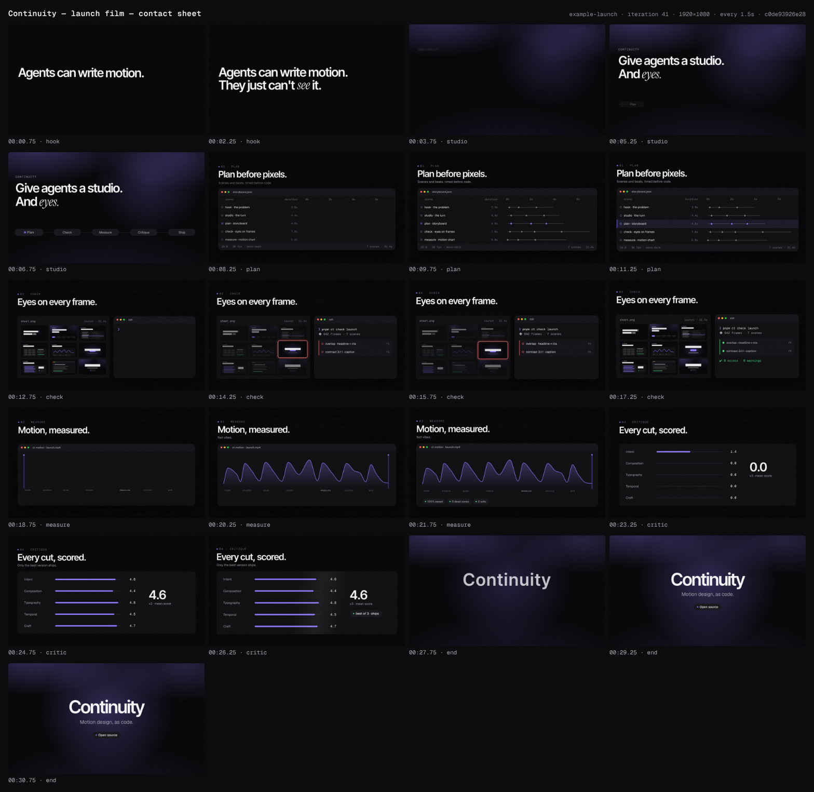
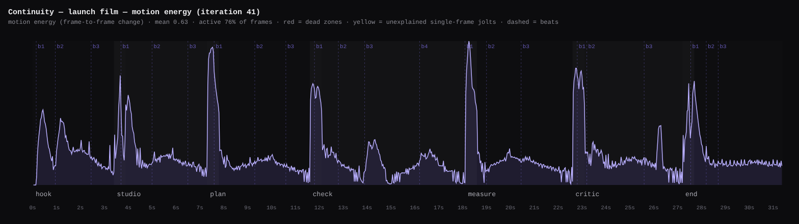

# Continuity — launch film

> For design engineers who have seen too much sloppy AI video: Continuity gives agents a studio process and eyes, so what they make is good enough to ship. Open source.

**Format:** 16:9 · 1920×1080 · 30fps · 31.4s · theme `mono-dark`

| # | Scene | In | Duration | Intent | Transition out |
|---|---|---|---|---|---|
| 1 | `hook` | 00:00.00 | 3.9s | Name the problem in one breath: agents can write motion, but they can't see it. | dip |
| 2 | `studio` | 00:03.40 | 4.4s | The turn: Continuity gives agents a studio process, and eyes. | push |
| 3 | `plan` | 00:07.30 | 4.8s | Plan before pixels: the director writes a storyboard of scenes, copy and timed beats before any code. | push |
| 4 | `check` | 00:11.60 | 7s | Eyes on every frame: the contact sheet shows a defect, the gate names it, the fix turns it green. | push |
| 5 | `measure` | 00:18.10 | 5s | Motion, measured: rhythm, easing and dead air are numbers the agent checks, not vibes. | push |
| 6 | `critic` | 00:22.60 | 5.1s | A critic scores every cut on five axes, and only the best version ships. | dip |
| 7 | `end` | 00:27.20 | 4.2s | Brand, promise, CTA: Continuity. Motion design, as code. Open source. | cut |

## Iteration #41 (best)

- Gate: ✅ pass — 0 errors, 0 warnings
- Critique: intent 5 · composition 4 · typography 5 · temporal 5 · craft 4 (mean 4.6)
- Render: `out/example-launch/example-launch-c0de93926e28.mp4`
- Note: All 3 round-2 polish items landed (storyboard-derived plan/measure data, violet-only aurora, check drift kills the 14.77 freeze; render QC clean). Remaining non-blocking: 1px scaleX seam at x=960 on critic bar fills, mild gradient banding in aurora render

## History

- #30 vs #39 → **#39** — Both passes agree (AB and BA): 39 wins intent (check resolves via strike-through instead of green 'overlap', measure chart shows this film's scenes), composition (chapter stack centred, not top-heavy), temporal (pushes carry surfaces, QC near-black gone, red settled 1.56s), craft (smooth chart, sheen settles). Typography even. Hook/studio/end identical. Gate 0/0 on both.
- #39 vs #41 → **#41** — Both passes agree (AB and BA): 41 wins craft (studio/end aurora is single-accent violet, teal gone; plan rows/beats/footer and measure labels now match the 31.4s cut: check 7.0s, beats 0.2/1.2/2.3/4.6, 7 scenes 31.4s; f4 thumb is a smooth curve) and temporal (check camera y-drift 3.20-6.50 removes the 1.50s render freeze at 14.77; activeShare 73.6->75.8%). Intent, composition, typography even; hook/studio/critic/end layouts identical. Gate 0/0 on both.

## Known polish (not blocking — critic, round 2)
- critic `bar0-fill…bar4-fill`: a 1px step at x=960 in the encoded render; switch the fills from scaleX to `wipeRight` (as the plan lanes do).
- studio/end aurora: faint banding in the dark violet gradient at ~3.7 Mbps 8-bit; render with `--quality delivery` or add grain.

## How this was made
Director agent → storyboard; 7 scene-builder agents in parallel (one per scene, isolated gates);
orchestrator cross-scene pass (shared Chapter layout + surface geometry); critic agent →
iteration 30 scored 3.8 (temporal 3) → round 1 (pushes carry surfaces, check climax,
centred chapters, real chart data, calmer critic) → iteration 39 scored 4.4 and won pairwise →
round 2 polish (data derived from the storyboard, single accent, check drift) → iteration 41
scored 4.6 and won pairwise. Gate (incl. --deep) 0/0; render QC clean; motion 76% active,
0 dead zones, 0 jolts.

